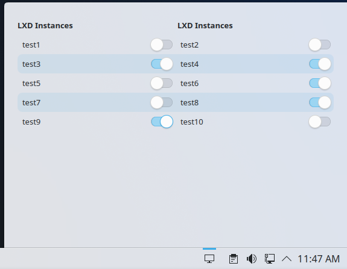

# lxd-tray: Manage lxd in Plasma Trayicon

## About
`lxd-tray` is a plasma applet for managing lxd containers. Start/stop any container without typing commands.



## Development
```
make install
```
Then you can add via the `Add or Manage Widgets` setting.
